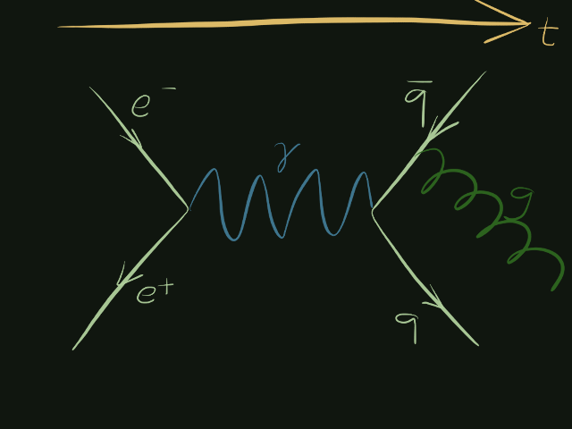

*In this talk, we'll contemplate the nature of time,
discover a simple algorithm that plays a perfect game of tic-tac-toe,
learn the meaning of the word "heuristic",
and share the curious experience of losing a real game
to a few lines of JavaScript code.*


## Intro intro (15s)

Hi, I'm Jason Orendorff.
This talk is about programs that play simple two-player games,
like tic-tac-toe.

But to get where we're going, we have to start with a seemingly unrelated question:
What is the shape of time?


## The shape of time (2m54s)

Well, time is a line.


We know this because there is a word in English
for a diagram where you draw a line,
and you mark events on it in chronological order.
It's called a timeline.

Now, if you're into special relativity,
or equivalently, if you've worked with distributed systems,
then you know this isn't quite true.
The nature of time can get really strange.


To say nothing of Richard Feynman's interpretation of positrons
as electrons moving backwards in time...



But we won't run into any of the truly weird stuff today.


*(slide: blank)*

Instead, let's turn our attention to a more basic problem.
If the past is a line, what is the shape of the future?

The ancient Stoics believed that the universe is deterministic.
Everything that happens is caused by earlier events and the laws of nature.


Here is the Stoic conception of a game of tic-tac-toe.
It's a timeline.
We can see snapshots of the game at the beginning
and after each move.

According to the Stoics,
if we played a game, and it went like this,
it could not have gone any other way.
So to the Stoics, whether we're looking at a game that has already happened,
or a game that has yet to happen,
time is a line either way.

History does not record whether the Stoics were any good at tic-tac-toe.
But their determinism denies something we will need
to write a good tic-tac-toe-playing program:
the notion of decisions as selecting from *multiple possible futures.*


*Photo credit: [Eric Vondy](https://www.flickr.com/photos/vondy/6280078972/)*

Let's rewind to the beginning of our game and I'll show you what I mean.


Here we are at the beginning of a new game.
Let's say we're playing X, and we get to go first.
We have nine different choices of where to play.
Nine paths.

Since I'm lazy, I'm only going to draw three of them.


From our decision point we could go here, or here, or here,
and the course of the game will be quite different depending on our choice.
But this is not the only choice that happens in the game.

Whichever path we choose, we immediately reach another decision point:
our opponent's turn.


And on it goes; but past this point it gets very hard
to fit all the possibilities on a screen.


In fact, they don't all fit; I had to leave some off.

The shape of the future, then, is this branching shape I like to call
the galactic time squid.

It's a technical term.

Some people call it a tree.

The Argentine poet Jorge Luis Borges wrote a short story about this shape.
He called it
["The Garden of Forking Paths"](https://en.wikipedia.org/wiki/The_Garden_of_Forking_Paths).


## An algorithm for winning (1m30s)

I chose tic-tac-toe because its time-squid is finite
and actually relatively small.
After at most nine moves, the game is over.
Sooner, if someone wins first.

As a consequence,
**there is a simple algorithm that will play this game perfectly.**
And not just this game, but every simple two-player game
where players take turns,
there's no element of chance,
and all the information is on the table.

There are a lot of simple two-player games.
Chess is like this.
Checkers is like this.
Mancala.
Go.
Othello.
Connect Four.
We'll see a game my kids call Pennies later on.

But let's start with tic-tac-toe.
Let's zoom way to the right and look at the very end of one arm
of the time-squid.


I'm going to show you this algorithm
that solves tic-tac-toe and those other games,
and then we're going to live-code it together.

Here we are at the end of a game of tic-tac-toe.
The battle lines are drawn.
It's X's turn, it'll be the seventh move of the game.
Then O will get a turn,
and then X will get the ninth and last turn of the game.
We're looking at all possible futures.
A funny thing about tic-tac-toe is that the ninth move
doesn't actually involve a choice;
there's only one place left to go.


### Why not just do the obvious thing?

Now maybe you can just look at this picture of all possible futures and "see" the answer.
And in fact if I erased all this junk
and just showed you the present tic-tac-toe grid,
you would say, oh, it's obvious.
You have to move here.

Because it's tic-tac-toe, after all.

But "oh just look at it, the answer is obvious" doesn't get us anywhere
if our goal is to teach a computer how to do this.
Nothing is obvious to a computer.
We have to somehow break this problem down into smaller parts
that we know how to automate.


### The negamax algorithm (1m57s)

Here's how we will do that.
We're going to write code to consider every possible move.
It's going to assign a score to every move in this whole tree.
The score will be +1 if it's a winning move,
-1 if it leads to a loss,
and 0 if it leads to a tie.

For example, this first move here.
X goes in the top center. Is that a good move?

Well, it's a *little* hard to know just yet.
Maybe it'll be easier to assign a score here if we look ahead
and score all the later moves in this branch of the tree first.

For example.
We can see that this topmost arm leads to an outcome where X wins.
Certainly the last move in this timeline is a +1.
X moves, X wins. That's pretty much the definition of a +1 move.

*(slide: same branching tree, but with the winning move on topmost path marked "+1")*

In fact, let's go ahead and assign a +1 to all these moves
that are straight-up game-winning moves.

*(slide: same branching tree; all winning moves are marked "+1")*

Now, what about the move immediately before this winning move?
*(indicating the winning move on the topmost path)*

O moved in the upper right corner.
That leads to X going in the center and winning the game.
Losing is bad, so I think O's move in the corner has to be a -1.

*(slide: same as before, but with O's move on the topmost path marked "-1")*

On the other hand O can reply by moving in the center
which immediately wins the game: +1.
*(indicating that +1 move, already marked as such on this slide)*

So now the interesting part.
How do we rate the move by X that got us here?
*(indicating X's move to the top center square, on turn 7 of the game,
the move that puts us in this situation)*
If X makes this move, X could win. Or lose.
Should I give this move a +1? Or a -1.

*(invite discussion)*

It's a -1, because we have to assume our opponent isn't stupid.
If they have a winning move, they'll take it.
So what we have to do here is look at both our opponent's moves,
and focus on the one that's best *for them*.
This move is a +1 for O. That means O wins.
So for X, the decision to go this route gets a -1.

*(slide: X's first option is marked "-1")*

All right. Applying the same reasoning to this option,
we see that X again is setting O up for victory here.

*(slide: X's second option, going in the upper right, is also marked "-1")*

What about the third choice?
If we make this choice, O can't win!
You can see that O only has bad options here: two -1 moves.
What's bad for O is good for us, right?
So what we do here is flip the sign.

If we choose a move, and O's best possible reply is -1,
that means our move must have been a +1.

*(slide: X's third option, going in the middle, is marked "+1". Every move is now marked.)*

Since this move is winning and these two are losing,
our choice is now obvious.
+1 is better than -1.


I bet even a computer can make this decision.

You can see how we make decisions based on looking at the future,
and we predict our opponents' decisions by looking at *their* future,
and so on.

*(switch from slides to editor, blank file)*


### Live-coding setup

When I decided to write some game-playing code,
I already knew all this stuff up to this point.
I knew the algorithm.

It still took me about a week of spare-time tinkering
to write the code that we're about to write.
And the reason is this classic thing that happens in programming:
you have to figure out how to break the problem down into reasonable parts,
where to draw the boundary between this and that.
Until you get it right, everything is horrible.

Where I ultimately landed is this:
I decided that there should be one chunk of code that represents the game,
and implements the rules of the game,
and then the AI part, the part we're about to write,
would be totally separate from that.

What I want is a function that computes the best possible move:

```javascript
function bestMove(game) {
    ???
}
```

Here `game` will be what I call a "game object",
and it's a snapshot of the game.
So in our case, `game` will contain a three-by-three grid of Xs and Os,
whose turn it is, and I guess that's it.

We're not going to write code for the rules of tic-tac-toe tonight.
Instead, we're going to assume the game object knows the rules.

This game object has three methods that we're going to use:

*   `game.moves()` returns an array of all possible moves from here.
    Not the entire tree of possible futures, now.
    Just the next move.

    So in tic-tac-toe, maybe each square has a number one to nine,
    and game.moves() returns an array of numbers.

    Remember in our diagram, snapshots look like this
    and moves are arrows,
    so these are game objects
    and the moves method returns an array of these three moves.

    At first, I had a `game.isOver()` method,
    but it turns out to be unnecessary.
    Instead, we'll just have `game.moves()` return an empty array
    if the game is over.

*   `game.applyMove(move)` takes the current snapshot,
    and returns a new game object
    that's a snapshot of what the game will look like
    after making that move.

    Game objects are immutable.

    In the picture, applyMove is how we follow an arrow to the right.
    Someone has to know the rules of the game in order to produce this
    next snapshot, so that's what the `.applyMove()` method is for.

*   `game.scoreFinishedGame()` is a method we're only going to call
    when the game is over. That is, `game.moves()` already returned empty.

    It returns +1 if the last move was a winning move,
    -1 if the last move somehow lost the game (in most games this can't happen),
    and 0 if the game ended in a tie.

OK. So this is the division of responsibilities.
We take for granted that this game object exists,
and these methods are implemented.
So the code we're going to write is responsible for doing one thing, and one thing only:
selecting the best move.

This brings us back to the function we sketched out, `bestMove()`.
I'm going to make one little change here,
which is to make the function return both the best move and its score.
We'll see why this is useful later.
Our algorithm computes both things anyway, so it's no extra trouble to return both.

```javascript
function bestMoveAndScore(game) {
    var bestMove;
    var bestScore;
    ???
    return {move: bestMove, score: bestScore};
}
```

Now we just have to fill in the question marks with code that contemplates all possible futures.
Even with everything we've talked about, it seems a little daunting, right?

So to help with this I'm going to write a second function, called `scoreMove`:

```javascript
function scoreMove(game, move) {
    ???
}
```

Instead of picking the best move, we're just going to look at this *one* move
and see how it looks.
The arguments are the current game state, and the move to evaluate.
The caller has to pass a move that's drawn from `game.moves()`, of course;
otherwise it would be an illegal move.

All right. So does anyone see a way to implement either one of these functions?

*(question for the audience: any suggestions?)*


### Implementing bestMoveAndScore(game)

OK, the first thing that's clear is that we're going to need to loop through all the possible moves from here.

```javascript
function bestMoveAndScore(game) {
    var bestMove;
    var bestScore;

    game.moves().forEach(function (move) {
        ???
    });
    return {move: bestMove, score: bestScore};
}
```

*(question for the audience, to check understanding:
What is `.forEach()`? What will this do?)*

What are we going to do to each move?
Well, we need to get a score for each move, right?
That's why I started writing that other function down there.
If we can get that working, then this part is easy:

```javascript
function bestMoveAndScore(game) {
    var bestMove;
    var bestScore;

    game.moves().forEach(function (move) {
        var score = scoreMove(game, move);
        ???
    }
    return {move: bestMove, score: bestScore};
}
```

And now what? Just keep track, as we go, of the best move we've seen so far:

```javascript
function bestMoveAndScore(game) {
    var bestMove;
    var bestScore;

    game.moves().forEach(function (move) {
        var score = scoreMove(game, move);
        if (score > bestScore) {
            bestMove = move;
            bestScore = score;
        }
    });
    return {move: bestMove, score: bestScore};
}
```

But I think we need to initialize these variables `bestMove` and `bestScore`.
*(discussion)*

What is a good starting value for `bestScore`?

```javascript
function bestMoveAndScore(game) {
    var bestMove = undefined;
    var bestScore = -Infinity;

    game.moves().forEach(function (move) {
        var score = scoreMove(game, move);
        if (score > bestScore) {
            bestMove = move;
            bestScore = score;
        }
    });
    return {move: bestMove, score: bestScore};
}
```

And that's it, this part is done!


### Implementing scoreMove(game, move)

How do we assign a score to a move?
I guess the first thing we need to do
is get a mental image of what the game will look like
after we actually take that move.

```javascript
function scoreMove(game, move) {
    var after = game.applyMove(move);
    ???
}
```

At this point, `game` still refers to the position *before* the move,
and `after` is a new game object that shows the position *after* the move.

Now we have a before and an after snapshot. How does that help us?

All right. Bear with me for a second.
Let's start by asking the `after` snapshot what moves are available.

```javascript
function scoreMove(game, move) {
    var after = game.applyMove(move);
    var ??? = after.moves();
    ???
}
```

What should we call this variable?
This is the set of moves available *after* our move,
so really it's an array of moves that will be available *to our opponent*.
How about `replies`.

```javascript
function scoreMove(game, move) {
    var after = game.applyMove(move);
    var replies = after.moves();
    ???
}
```

OK. At this point there are two distinct possibilities:
either the array is empty, meaning there are no more moves and the game is over;
or it's non-empty and we have to somehow compute a score for `move`
based on the `replies` it leaves open for our opponent.

What should we do if the game is over?
Right, the rules of the game tell us who won in that case:

```javascript
function scoreMove(game, move) {
    var after = game.applyMove(move);
    var replies = after.moves();

    if (replies.length === 0)
        return after.scoreFinishedGame();

    ???
}
```

But if the game is still on, then what?
We have to compute a score for `move` based on how our opponent will respond.

```javascript
function scoreMove(game, move) {
    var after = game.applyMove(move);
    var replies = after.moves();

    if (replies.length === 0)
        return after.scoreFinishedGame();
    else
        return bestMoveAndScore(after).score;  // BUG
}
```

But there's actually something critically wrong with that code;
anyone see it?

Right, anything that's good for our opponent is bad for us.
So a positive score for our opponent should be a negative score for us.
Add a minus sign:

```javascript
function scoreMove(game, move) {
    var after = game.applyMove(move);
    var replies = after.moves();

    if (replies.length === 0)
        return after.scoreFinishedGame();
    else
        return -bestMoveAndScore(after).score;
}
```

Incidentally, it is shockingly easy to make mistakes in this algorithm,
and believe me, I wrote every bug that it's possible to write.
The algorithm is amazingly difficult to debug,
because the trickiest kind of bug is just leaving off this minus sign,
or using a less-than symbol instead of greater-than,
and when you do that, you don't get an exception.
Instead the program just plays the game really badly.
I've played chess games where I got something backwards
and so the computer tries to get you to capture all its pieces.
But not in the obvious way of just handing them over for you to capture, no,
because the AI is so screwed up it thinks I will try really hard to avoid capturing them,
so instead it's very carefully trying to *force* me to capture them,
which is best accomplished by putting me in check!
It's a really devious, sophisticated kind of playing to lose!


### Done!

So here is the complete code, which may or may not be full of bugs:

```javascript
function bestMoveAndScore(game) {
    var bestMove = undefined;
    var bestScore = -Infinity;

    game.moves().forEach(function (move) {
        var score = scoreMove(game, move);
        if (score > bestScore) {
            bestMove = move;
            bestScore = score;
        }
    });
    return {move: bestMove, score: bestScore};
}

function scoreMove(game, move) {
    var after = game.applyMove(move);
    var replies = after.moves();

    if (replies.length === 0)
        return after.scoreFinishedGame();
    else
        return -bestMoveAndScore(after).score;
}
```

It fits on one screen, and it will play any simple two-player game flawlessly.

*(see [ai.js](ai.js) in this repository)*


## Demo time: Pennies

Let's try it out with a game called Pennies.

Pennies is an extremely simple game.
You start out by putting some number of pennies on the table.
On your turn, you get to take 1, 2, or 3 pennies.
But your goal is not to take as many pennies as possible.
Whoever takes the last penny wins. OK?

Let's play:

*(demo: Pennies. You can play by going to <http://jorendorff.github.io/negamax/>,
opening your dev console, and typing `play(Pennies)`.
The game is winnable, and it's a great little puzzle to figure out how!
When I give this talk live, we play by levels of audience applause,
and we are virtually guaranteed to lose—it's awesome. :smile:)*

I won't show code for all these games, but
I want to show the complete implementation of Pennies,
using an ES6 class.

I'm not showing the front-end code,
but here's the model, as an ES6 class:

```javascript
class Pennies {
    constructor(n) { this.pennies = n; }
    moves() { return [1, 2, 3].filter(m => this.pennies >= m); }
    scoreFinishedGame() { return +1; }
    applyMove(move) { return new Pennies(this.pennies - move); }
}
```

If you aren't familiar with ES6 classes, I'm sorry, but this part will be over quickly!

Remember we said earlier that this game object does two things:
it's a snapshot of the game state;
and it's responsible for knowing the rules of whatever game we're playing.
Now we get to see what that means.

This `Pennies` object is the game object for the game of pennies,
so each `Pennies` object is a snapshot of a game in progress.

The number of pennies currently on the table is `this.pennies`,
and here are our three methods implementing the rules of Pennies:

*   `.moves()` returns the array `[1, 2, 3]`,
    but `3` is not a legal move when there's only 1 or 2 pennies remaining,
    so that's what the `.filter()` is about.

*   `.scoreFinishedGame()` always returns +1,
    because if the game is over after your turn,
    that means you took the last penny and won the game.
    There are no ties in Pennies.

*   `.applyMove()` simply subtracts the number of pennies you took,
    and returns a new game object with that smaller number of pennies.

This game is super simple, so the implementation is very short,
especially if you squeeze out all the whitespace, like I did here.
But tic-tac-toe is more than 50 lines of code.

*(You can see it in [game.js](game.js) in this repository.)*

Think about that--implementing the *rules* of tic-tac-toe takes more code
than it takes to *play* tic-tac-toe perfectly!

*(optional demo: tic-tac-toe)*


### Mutual recursion

*(logically this belongs right after we finish implementing the algorithm,
but as a matter of pacing the demo has to come first)*

Note that each function calls the other.
Is there a problem with this? Where does it ever end?

*(discussion)*

What is this called?

The first time I ever spoke to a Nashville Software School class,
a student asked, "When is it appropriate to use recursion?"
It was a good question. I didn't have a great answer.
But I have noticed when you see a branching tree shape,
and you know your program needs to look at every part of the tree,
in that case, recursion is certainly the easiest way to go.


## From tic-tac-toe to chess

OK. So we've seen the same code play two different games.
That's possible because we designed this set of three methods
that any game can implement.
And then we wrote the code to work with
*only* those three methods.

Another way of saying it is that many games are similar,
and this three-method interface captures that essential similarity.

*(slide: back to the tic-tac-toe tree, with scores assigned to every move)*

But this algorithm needs to be modified slightly for chess.
Why?

*(pause for audience answers)*

Chess is big.

*(slide: "there are more possible chess games than the number of atoms in the universe")*

So what do we need to do for chess?


### Make the tree finite

This generally means setting some fixed or mostly-fixed search depth,
say, you decide to look ahead only three moves, then stop.

In chess, if you look ahead four moves---
that is, four of your moves and your opponent's four replies---
you're already looking at *billions* of possible futures.
So maybe three is a good number. Maybe two.

But how will this work?
Remember, our algorithm works by assigning a score to each move
based on the scores of the moves in its future.

How do you assign a score to a move
if you don't know what the future will bring?

Well, at that point, you guess.
You look ahead your three moves or whatever,
and then at that point, you look at the board and say,
well, I lost my queen. This is bad.
What score should I assign?
I could assign this line of moves a -1.
But at this point, it's good to start using a whole range of scores,
not just one, zero, and minus one.
If a move leads to my losing my queen, that might be worth
minus zero point six.
Then, my program then knows that that's not as bad as being checkmated,
but it's still pretty bad.

So, to modify this algorithm to work for chess, I would do two things.

1.  Add a *depth limit*,
    so we don't search all possible chess games.

2.  When the depth limit is reached,
    *estimate* how good or bad the resulting board is.
    The code that computes this estimation is called a heuristic function.

Heuristic is a great word in software engineering.

Heuristic means—this is not what your dictionary will say,
but trust me—an approach to a problem is heuritic if it's effective mainly
because you put a lot of domain-specific knowledge and hacks into it,
not because you thought of a clever, general algorithm.

So heuristic means "we happen to know this usually works in practice".

The heuristic algorithm for assigning a score to a chess board
will be completely different from the heuristic for go
or any other game.
It'll know things about chess.
For example, it'll know that pieces protecting each other is good.
It'll know that attacking your opponents' pieces is good.
It'll know that a queen is worth more than a knight.
And so on.

OK. So that's the main thing: make the tree finite.

How does that affect our code? Well, we would add two arguments:
a depth limit and a heuristic function.
And we'll add some code that says, when the depth limit reaches 0,
instead of calling scoreMove, call the heuristic function.
The rest of the algorithm would be unchanged.


### Make the code faster

At that point, what limits the quality of our program?

Well, what do you think the depth limit will be?

A couple people wrote chess-playing programs for NashFP,
and I think the best we actually managed was 2.
So on the computers turn,
it considers its move, your response, its next move, and your response to that,
and that's all.

This is terrible.
Human players will demolish your program if it only looks ahead two moves.

So how can we improve on this?

The most obvious thing is, what happens if we just bump the depth limit to 3?
Well, that makes our program too slow.
So why not just make the program faster?

*   **Alpha-beta pruning,** an algorithm that produces
    the same results as negamax or minimax, i.e. the best move, but works faster.

    Here's how this works:
    If you're looking at a move,
    and you find out your opponent has a killer reply
    that absolutely wrecks you,
    then it's usually not necessary to evaluate your opponent's other available replies.
    One killer reply is enough to sink a move.
    You can give up on that move and spend your time elsewhere.

    It's called pruning because you snip off bad parts of the tree.

*   **Bitboards** -
    The set of all pawns on the board
    can be represented by a 64-bit integer; and so on.

*   **Transposition tables** -
    Use tons of memory to find places where instead of a tree,
    we really have a dag, and skip redundant computation

    *(slide: highlight identical futures reached by two different paths)*


### Embed more domain-specific knowledge

A pure AI like the one we've got will stink in the early game
and in the endgame.

Why in the early game?
Because looking ahead two or three moves in the opening
actually just doesn't get you far enough down the road
to be able to assign good scores to moves.
By contrast your opponents, certainly if they're humans who've studied chess,
will have so much experience in the opening that they know which moves are good,
based on the experience of millions of chess players over billions of games.

So what do we need to do?
We can add a database of opening moves.
Just the most common openings might be a big advantage.

To see why our program will stink it up in the endgame,
consider this situation: we have a rook and a king, our opponent has a king.
A lot of games end this way.
You can win this game, but
I think there's only one way to do it.
You have to force the enemy king to the edge of the board.

That might take twenty moves.

Our program, looking ahead two moves,
might very likely find all its available moves to be equally pointless,
except for a few real stinkers that result in losing the rook.
It has no hope of discovering the technique that leads to checkmate.

We can fix this by adding custom code that kicks in
when we reach endgames with known solutions.


## Chess demo

I wrote a program to play chess.
This was my overall goal when I set out.
It was a lot of fun.
I learned some things.

I haven't implemented all the things I just talked about,
but it was fun.
Let's close with a demo of this program playing chess.
I played it against a **very** weak chess program written in the 1970s,
called Microchess,
which is [another whole story](https://github.com/jorendorff/computer-chess/tree/master/jorendorff%2Bcpp)...

Since both programs are deterministic,
against each other they only play one game.
The same game every time. Very Stoic.
I've uploaded a transcript of that game, so you can
[view the game online with super cool analysis by lichess.org](http://en.lichess.org/dY0sf3Vc).
*(Seriously, if you're reading this on the web, check that link out!)*

It is a wild, goofy game, with a lot of mistakes on both sides.
Microchess is playing white.
And it hangs in there, actually goes up a few pawns,
but it already seems to be losing
when it plays back-to-back blunders with **27. Rg1**
(missing a chance to simply take the knight and go ahead in material)
and **28. Rh1** (accomplishing nothing and throwing away the rook at a1).
And it's all downhill from there.

(**17. Nxg7+** is not so hot either; **17. Nc7+** seems clearly better.)

----

*In case that link dies,
here's PGN for the game, which you can paste into
[any number of](http://www.chess.com/analysis-board-editor)
[online](http://chesstempo.com/pgn-viewer.html)
[chessboards](http://www.chessvideos.tv/chess-game-uploader.php).*

    [Event "Microchess vs. negamax demo"]
    [Date "2015.04.28"]
    [White "Microchess"]
    [Black "jorendorff_rust"]
    [Result "0-1"]
    1. e4 d5 2. Bb5+ c6 3. Ba4 dxe4 4. Qh5 b5 5. Bb3 e6 6. Nc3 Qd4
    7. Nge2 Qc5 8. Qxc5 Bxc5 9. Nxe4 Be7 10. Nd4 e5 11. Nf3 Nf6 12. Nc3 b4
    13. Na4 e4 14. Ng5 Be6 15. Bxe6 fxe6 16. Nxe6 Nbd7 17. Nxg7+ Kf7 18. Nf5 Bf8
    19. Nd4 Rg8 20. Nxc6 Rxg2 21. Kf1 Rg8 22. d4 Rc8 23. Nxa7 Rxc2 24. Bf4 Ng4
    25. h3 Rxf2+ 26. Ke1 Rxf4 27. Rg1 Ne3 28. Rh1 Nc2+ 29. Kd2 Rg2+ 30. Kc1 Nxa1
    31. Kb1 Nc2 32. d5 Ne3 33. Re1 Nc2 34. Rc1 Ne3 35. Rc7 Rf1+ 36. Rc1 Rgg1
    37. Rxf1+ Rxf1#


## Talk history

*   NashFP first, of course - 28 April 2015. With Calvin Bottoms.

*   NashJS - 13 May 2015. 48 minutes, including demos.

*   Nodevember, 15 Nov 2015. Cut a ton of stuff for time. ~32 minutes.
